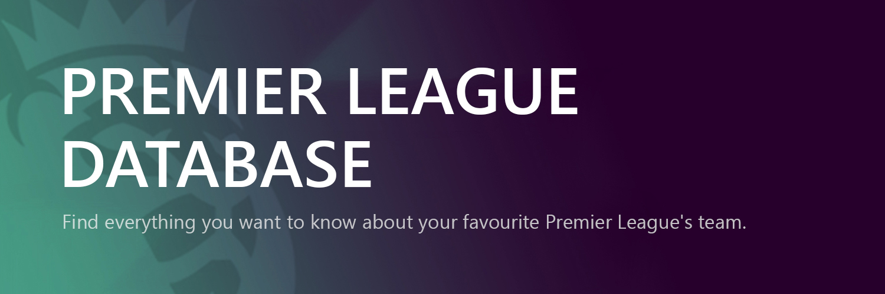
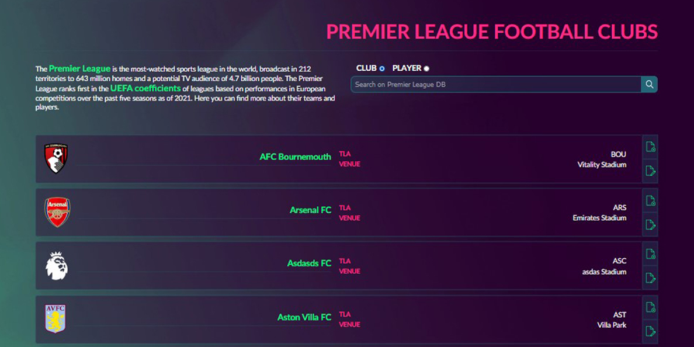
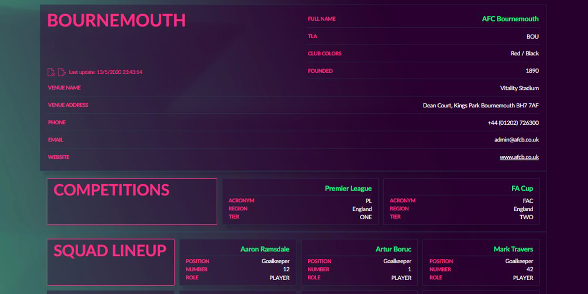
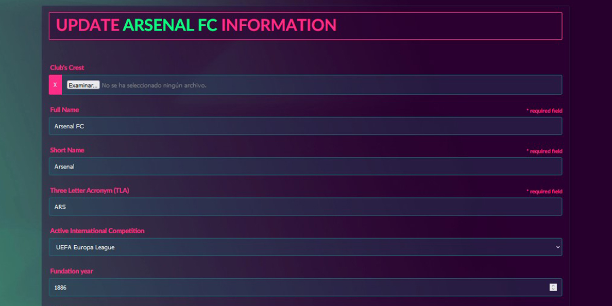

<h2 align="center">Premier League DB. A MERN stack project.</h2>

This simple project is an exercise of the introductory course to Node.js provided by <a href="https://argentinaprograma.com" target="_blank">"r/Argentina Programa"</a>. The data used for this exercise was provided by <a href="https://www.football-data.org" target="_blank">football-data.org API</a>. The web design and page layout is a design of my own.

 

<h1>Key Features.</h1>
<ul>
  <li>Search-</li>
  <li>Display-</li>
  <li>Create and Update-</li>
</ul>

 
<h2>Search.</h2>

The Database contains all the Members Clubs and Players ordered alphabetically. Each entry shows some of the clubs or player information along side EDIT/DELETE shortcuts. Click on the resource's name and gain access to all our data.

 

 
<h2>Display.</h2>

Look between the 20 Members Clubs who make up the League at any one time and between 600+ Players. Check their info, update it, create new Clubs and delete those relegated to the League One.

 

 
<h2>Create and Update.</h2>

All the information about the club, including the squad lineup, its exposed to you for editing, just beware of the required entries.

 

 
<h2>Credits</h2>
<ul>
  <li>You can visit <a href="https://argentinaprograma.com" target="_blank">r/Argentina Programa</a> to access the ongoing course for free.</li>
</ul>
